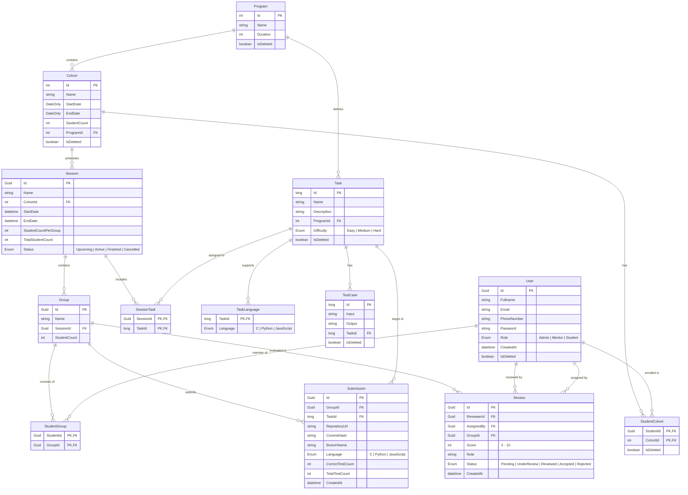

# PLDMS - Texniki Sənəd

Platforma vasitəsilə mentorlar sessiyalar yarada, tasklar təyin edə, tələbələri qruplara bölə və onların submit etdiyi layihələri izləyə bilirlər. Tələbələr isə aid olduqları sessiyalar çərçivəsində qrup şəklində verilmiş taskları yerinə yetirir, GitHub üzərindən submission təqdim edir və təyin olunduqları hallarda digər qrupların işlərini peer-review edirlər. Sistem həm mentor, həm də tələbə tərəfindən qiymətləndirmə prosesini mərkəzləşdirərək öyrənmə, əməkdaşlıq və real proqramçı iş axınını simulyasiya etməyi hədəfləyir.

## 1. Rollar

- Admin
	- Mentor və Tələbələr idarə edir
	- Cohortları idarə edir
	- Programları idarə edir

- Mentor
	- Sessiyaları idarə edir
	- Tasklar və onlar üçün testləri idarə edir
	- Taskları review edir
	- Taskları review etməsi üçün başqa tələbələrə yönləndirə bilir

- Student
	- Sessiyalarda iştirak edir
	- Aid olduğu sessiya üzrə qrup şəklində verilən taskları yerinə yetirir
	- Təyin olunmuş taskları review edir

## 2. Biznes qaydaları

- Tələbə eyni anda bir sessiya da ola bilər
- Eyni kohort üzrə eyni tarix aralığında sessiya yarana bilməz
- Sessiyalar eyni gün daxilində bitməlidir
- Əgər sessiya başlamayıbsa, ona aid tasklar dəyişdirilə bilər
- Sessiya başlamayıbsa, silinə bilər, başladıqdan sonra silinməyi mümkün deyil
- Qruplar hər sessiya üçün random şəkildə ayrıca yaradılır, qrup başına tələbə sayı user tərəfindən daxil olunur
- Hər submission ayrı git commiti sayılır və kodlar githubda saxlanılır
- Review sadəcə son submissiona ola bilər və bir qrupun bütün taskları üzrə review verilir
- Reviewin tələbə tərəfindən verilməyi məcburi deyil,mentorlar özləri də review verə bilər
- Qrup və Sessiya adları verilməzsə sistem tərəfindən random adların yaradılır
- Sessiya vaxtı bitdikdən sonra submission mümkün deyil
- Sessiya vaxtı bitmədən review mümkün deyil

## 3. Əsas funksionallıqlar

### 3.1 Admin

- Admin ilkin olaraq bir ədəd yaranır

- Yeni mentorlar və tələbələr yarada bilir

- İstifadəçilər siyahısını görə bilir

### 3.2 Mentor

- Sessiya siyahısını görə bilir və idarə edir:
	- Ada, Statusa, Başlanğıc və Bitiş tarixinə əsasən axtarış və filtrləmə mövcuddur
	- Sessiyalar daxilində qrupları və onların submissionlarını görə bilir

- Tasklar siyahısını görə bilir və idarə edir:
	- Ada, Çətinliyinə, Programa və Silinmiş olub olmamağına əsasən axtarış mövcuddur

- Review siyahısını görə bilir və idarə edir:
	- Statusa əsasən axtara bilir
	- Tələbələrə submissionları yönəldə bilir
	- Review edə bilir

### 3.3 Student

- Özünün indiki və köhnə sessiyalarını görə bilir:
	- Ada, Statusa, Başlanğıc və Bitiş tarixinə əsasən axtarış və filtrləmə mövcuddur
	- Sessiyalarda iştirak edir

- Özünə təyin olunmuş reviewləri görüb yoxlaya bilir:
	- Statusa əsasən axtara bilir

## 4. Databaza Strukturu

### 4.1 ER Diaqramı

*Diaqram AI tərəfindən hazırlanıb.

### 4.2 Modellər

- User
	- Id
	- Fullname
	- Email
	- PhoneNumber
	- Password
	- Role: [Admin - Mentor - Student] | [Enum]
	- CreatedAt
	- IsDeleted

- Cohort
	- Id
	- Name
	- StudentCount
	- StartDate
	- EndDate
	- ProgramId
	- IsDeleted

- StudentCohort
	- StudentId
	- CohortId
	- IsDeleted

- Program
	- Id
	- Name
	- Duration
	- IsDeleted

- Session
	- Id
	- Name
	- CohortId
	- StartDate
	- EndDate
	- StudentCountPerGroup
	- TotalStudentCount
	- Status: [Upcoming - Active - Finished - Cancelled] | [Enum]

- Task
	- Id
	- Name
	- Description
	- ProgramId
	- Difficulty: [Easy - Medium - Hard] | [Enum]
	- IsDeleted

- TaskLanguage
	- TaskId
	- Language: [C - Python - JavaScript] | [Enum]

- SessionTask
	- SessionId
	- TaskId

- Test Case
	- Id
	- Input
	- Output
	- TaskId
	- IsDeleted

- Group
	- Id
	- Name
	- SessionId
	- StudentCount

- StudentGroup
	- StudentId
	- GroupId

- Submission
	- Id
	- GroupId
	- TaskId
	- RepositoryUrl
	- CommitHash
	- BranchName
	- Language: [C - Python - JavaScript] | [Enum]
	- CorrectTestCount
	- TotalTestCount
	- CreatedAt

- Review
	- Id
	- ReviewerId
	- AssignedBy
	- GroupId
	- Score: [0 - 10]
	- Note
	- Status: [Pending - UnderReview - Reviewed - Accepted - Rejected] | [Enum]
	- CreatedAt