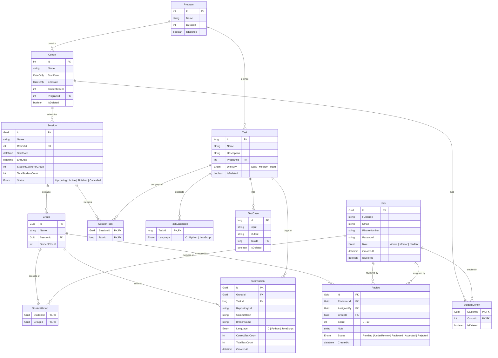

# PLDMS - Technical Documentation

Through the platform, mentors can create sessions, assign tasks, divide students into groups, and track the projects they submit. Students complete assigned tasks collaboratively in groups within their respective sessions, submit their work via GitHub, and peer-review other groups' work when assigned. The system aims to simulate learning, collaboration, and a real-world developer workflow by centralizing the evaluation process for both mentors and students.

## 1. Roles

- Admin
	- Manages Mentors and Students
	- Manages Cohorts
	- Manages Programs

- Mentor
	- Manages Sessions
	- Manages Tasks and their tests
	- Reviews Tasks
	- Can assign tasks to other students for review

- Student
	- Participates in Sessions
	- Completes group tasks assigned within their session
	- Reviews assigned tasks

## 2. Business Rules

- A student can only be in one session at a time
- Sessions cannot be created within the same date/time range for the same cohort
- Sessions must end within the same day
- If a session has not started, its tasks can be modified
- If a session has not started, it can be deleted; once started, it cannot be deleted
- Groups are created randomly for each session; the student count per group is specified by the user
- Each submission is considered a separate Git commit, and the code is stored on GitHub
- A review can only be made on the latest submission, and a review is given for all tasks of a group
- Reviews do not necessarily have to be submitted by students; mentors can also submit reviews themselves
- If group and session names are not provided, random names are generated by the system
- Submissions are not allowed after the session time ends
- Reviews are not allowed before the session time ends

## 3. Core Functionalities

### 3.1 Admin

- Initially, a single Admin is created

- Can create new mentors and students

- Can view the user list

### 3.2 Mentor

- Can view and manage the session list:
	- Search and filtering available by Name, Status, Start Date, and End Date
	- Can view groups and their submissions within sessions

- Can view and manage the task list:
	- Search available by Name, Difficulty, Program, and whether it is deleted

- Can view and manage the review list:
	- Can search by Status
	- Can assign submissions to students
	- Can conduct reviews

### 3.3 Student

- Can view their current and past sessions:
	- Search and filtering available by Name, Status, Start Date, and End Date
	- Participates in sessions

- Can view and evaluate assigned reviews:
	- Can search by Status

## 4. Database Structure

### 4.1 ER Diagram

*Diagram is created by AI.

### 4.2 Models

- User
	- Id
	- Fullname
	- Email
	- PhoneNumber
	- Password
	- Role: [Admin - Mentor - Student] | [Enum]
	- CreatedAt
	- IsDeleted

- Cohort
	- Id
	- Name
	- StudentCount
	- StartDate
	- EndDate
	- ProgramId
	- IsDeleted

- StudentCohort
	- StudentId
	- CohortId
	- IsDeleted

- Program
	- Id
	- Name
	- Duration
	- IsDeleted

- Session
	- Id
	- Name
	- CohortId
	- StartDate
	- EndDate
	- StudentCountPerGroup
	- TotalStudentCount
	- Status: [Upcoming - Active - Finished - Cancelled] | [Enum]

- Task
	- Id
	- Name
	- Description
	- ProgramId
	- Difficulty: [Easy - Medium - Hard] | [Enum]
	- IsDeleted

- TaskLanguage
	- TaskId
	- Language: [C - Python - JavaScript] | [Enum]

- SessionTask
	- SessionId
	- TaskId

- Test Case
	- Id
	- Input
	- Output
	- TaskId
	- IsDeleted

- Group
	- Id
	- Name
	- SessionId
	- StudentCount

- StudentGroup
	- StudentId
	- GroupId

- Submission
	- Id
	- GroupId
	- TaskId
	- RepositoryUrl
	- CommitHash
	- BranchName
	- Language: [C - Python - JavaScript] | [Enum]
	- CorrectTestCount
	- TotalTestCount
	- CreatedAt

- Review
	- Id
	- ReviewerId
	- AssignedBy
	- GroupId
	- Score: [0 - 10]
	- Note
	- Status: [Pending - UnderReview - Reviewed - Accepted - Rejected] | [Enum]
	- CreatedAt